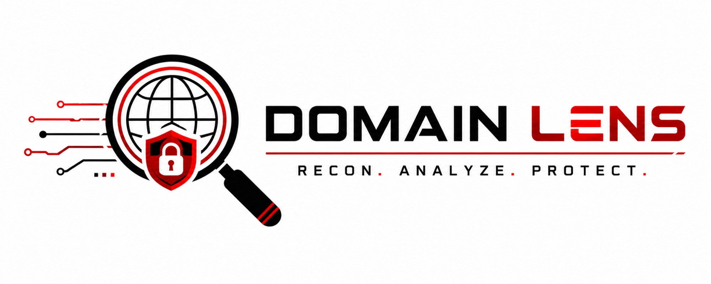

# DomainLens

<p align="center">
  
</p>
<p align="center">
  
  
  
</p>

Collects basic domain data and generates structured reports.

DomainLens is a lightweight **passive reconnaissance** CLI tool designed for defenders, students and authorized security testing.  
It collects key information about a domain and exports it into clean, readable reports.

---

## 🔎 Overview

The tool focuses on collecting and organizing publicly available data about a domain.
It does not perform exploitation or intrusive scanning.

---

## 🧩 Functionality

- DNS records (A, AAAA, CNAME, MX, TXT, NS)
- HTTP / HTTPS checks
  - status code
  - redirect chain
  - response time
  - server header
- robots.txt and sitemap.xml detection
- selected HTTP security headers
- TLS certificate details
  - issuer
  - expiry date
  - subject alternative names
- optional subdomain lookup using crt.sh

---

## ⚙️ Installation

From source:
```bash
git clone https://github.com/shelvy1337/domainlens.git
cd domainlens
pip install -e .
```

Alternatively:
```bash
pip install -r requirements.txt
```

---

## 📊 Analysis

DomainLens includes a simple evaluation layer based on collected data:
- basic security score (0–100)
- header presence checks
- detection of common configuration issues
- list of findings with severity levels and short recommendations

This is meant as a quick overview, not a full security assessment.

---

## 🚀 Usage

Basic scan:
```bash
domainlens example.com
```

Full scan:
```bash
domainlens example.com --all
```

Custom output directory:
```bash
domainlens example.com --out reports/
```

Enable subdomain lookup:
```bash
domainlens example.com --subdomains
```

---

## 📁 Output

Results are written to:
- `report.json` – structured output  
- `report.md` – readable report  

Example:
```
reports/example.com/report.json
reports/example.com/report.md
```

---

## 📌 Requirements
* Python 3.10+

---

## ⚠️ Disclaimer
This tool is intended for **educational purposes** and **authorized security testing only**.

Use DomainLens only on:
- domains you own, or
- systems you have explicit permission to test.

DomainLens performs **passive reconnaissance** and does not include exploitation, brute force or phishing functionality.
